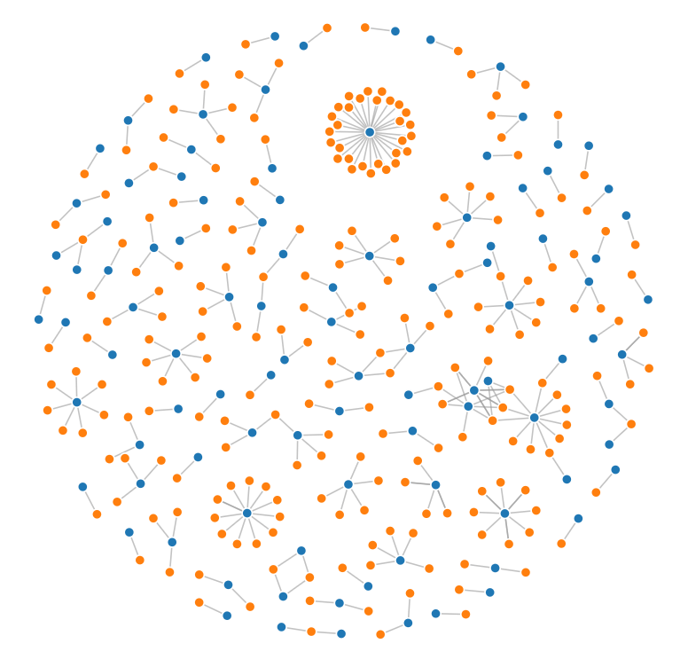

Disjoint Force Graph
====================

1. Load data

.. code:: python

   # https://observablehq.com/@d3/disjoint-force-directed-graph/2
   import json
   from math import sqrt
   import requests
   import detroit_live as d3

   URL = "https://static.observableusercontent.com/files/e3680d5f766e85edde560c9c31a6dba2ddfcf2f66e1dced4afa18d8040f1f205e0bde1b8b234d866373f2bfc5806fafc47e244c5c9f48b60aaa1917c1b80fcb7?response-content-disposition=attachment%3Bfilename*%3DUTF-8%27%27graph.json"

   data = json.loads(requests.get(URL).content)

2. Prepare the force graph

.. code:: python

   width = 928
   height = 680

   # Specify the color scale.
   color = d3.scale_ordinal(d3.SCHEME_CATEGORY_10)

   # The force simulation mutates links and nodes, so create a copy
   # so that re-evaluating this cell produces the same result.
   links = data["links"]
   nodes = data["nodes"]

   # Create a simulation with several forces.
   simulation = (
       d3.force_simulation(nodes)
       .set_force("link", d3.force_link(links).set_id(lambda d: d["id"]))
       .set_force("charge", d3.force_many_body())
       .set_force("x", d3.force_x())
       .set_force("y", d3.force_y())
   )

   # Create the SVG container.
   svg = (
       d3.create("svg")
       .attr("width", width)
       .attr("height", height)
       .attr("viewBox", " ".join(map(str, [-width / 2, -height / 2, width, height])))
       .attr("style", "max-width: 100% height: auto")
   )

   # Add a line for each link, and a circle for each node.
   link = (
       svg.append("g")
       .attr("stroke", "#999")
       .attr("stroke-opacity", 0.6)
       .select_all("line")
       .data(links)
       .join("line")
       .attr("stroke-width", lambda d: sqrt(d["value"]))
   )

   node = (
       svg.append("g")
       .attr("stroke", "#fff")
       .attr("stroke-width", 1.5)
       .select_all("circle")
       .data(nodes)
       .join("circle")
       .attr("r", 5)
       .attr("fill", lambda d: color(d["group"]))
   )

   node.append("title").text(lambda d: d["id"])

3. Create and add event callbacks to the simulation and nodes

.. code:: python

   # Set the position attributes of links and nodes each time the simulation ticks.
   def tick(simulation):
       (
           link.attr("x1", lambda d: d["source"]["x"])
           .attr("y1", lambda d: d["source"]["y"])
           .attr("x2", lambda d: d["target"]["x"])
           .attr("y2", lambda d: d["target"]["y"])
       )
       node.attr("cx", lambda d: d["x"]).attr("cy", lambda d: d["y"])

   simulation.on("tick", tick, extra_nodes=link.nodes() + node.nodes())

   # Reheat the simulation when drag starts, and fix the subject position.
   def dragstarted(event, d, node):
       if not event.active:
           simulation.set_alpha_target(0.3).restart()
       event["subject"]["fx"] = event["subject"]["x"]
       event["subject"]["fy"] = event["subject"]["y"]

   # Update the subject (dragged node).osition during drag.
   def dragged(event, d, node):
       event["subject"]["fx"] = event.x
       event["subject"]["fy"] = event.y

   # Restore the target alpha so the simulation cools after dragging ends.
   # Unfix the subject position now that it's no longer being dragged.
   def dragended(event, d, node):
       if not event.active:
           simulation.set_alpha_target(0)
       event["subject"]["fx"] = None
       event["subject"]["fy"] = None

   # Add a drag behavior.
   node.call(
       d3.drag()
       .on("start", dragstarted)
       .on("drag", dragged)
       .on("end", dragended)
   )

4. Create an application and run it locally

.. code:: python

   svg.create_app().run()

.. warning::

   There are some performance issues that will be fixed in future versions.
