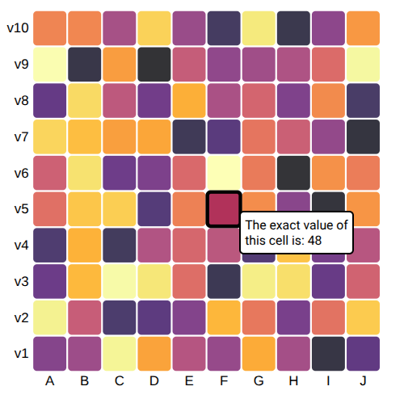

Heatmap
=======

1. Load data

.. code:: python

   # https://d3-graph-gallery.com/graph/interactivity_tooltip.html#template
   from collections import namedtuple
   from pathlib import Path
   import detroit_live as d3
   import polars as pl

   # https://github.com/bourbonut/detroit-live/blob/main/examples/styles/heatmap.css
   # Style used later in the example
   STYLE_PATH = Path(__file__).resolve().parent / "styles" / "heatmap.css"

   URL = "https://raw.githubusercontent.com/holtzy/D3-graph-gallery/master/DATA/heatmap_data.csv"
   heatmap = pl.read_csv(URL)

.. code::

   shape: (100, 3)
   ┌───────┬──────────┬───────┐
   │ group ┆ variable ┆ value │
   │ ---   ┆ ---      ┆ ---   │
   │ str   ┆ str      ┆ i64   │
   ╞═══════╪══════════╪═══════╡
   │ A     ┆ v1       ┆ 30    │
   │ A     ┆ v2       ┆ 95    │
   │ A     ┆ v3       ┆ 22    │
   │ A     ┆ v4       ┆ 14    │
   │ A     ┆ v5       ┆ 59    │
   │ …     ┆ …        ┆ …     │
   │ J     ┆ v6       ┆ 64    │
   │ J     ┆ v7       ┆ 4     │
   │ J     ┆ v8       ┆ 12    │
   │ J     ┆ v9       ┆ 97    │
   │ J     ┆ v10      ┆ 72    │
   └───────┴──────────┴───────┘

2. Prepare containers to make the heatmap chart

.. code:: python

   # Transform data into dictionaries
   data = heatmap.to_dicts()

   # Process useful data
   groups = heatmap["group"].unique().sort().to_list()
   variables = heatmap["variable"].unique().to_list()
   variables = sorted(variables, key=lambda v: int(v[1:]))

   # Declare the chart dimensions and margins
   Margin = namedtuple("Margin", ("top", "right", "bottom", "left"))
   margin = Margin(20, 25, 30, 40)
   width = 450 - margin.left - margin.right
   height = 450 - margin.top - margin.bottom

   # Create HTML container and add style in <head>
   html = d3.create("html")
   html.append("head").append("style").text(STYLE_PATH.read_text())
   body = html.append("body").append("div")

   # Create the SVG container.
   svg = (
       body.append("svg")
       .attr("width", width + margin.left + margin.right)
       .attr("height", height + margin.top + margin.bottom)
       .append("g")
       .attr("transform", f"translate({margin.left},{margin.top})")
   )

   # Tooltip used when an rectangle is hovered
   tooltip = body.append("div")

   # Declare the x (horizontal position) scale.
   x = d3.scale_band().set_range([0, width]).set_domain(groups).set_padding(0.05)

   # Add the x-axis.
   (
       svg.append("g")
       .style("font-size", 15)
       .attr("transform", f"translate(0,{height})")
       .call(d3.axis_bottom(x).set_tick_size(0))
       .select(".domain")
       .remove()
   )

   # Declare the y (vertical position) scale.
   y = d3.scale_band().set_range([height, 0]).set_domain(variables).set_padding(0.05)

   # Add the y-axis.
   (
       svg.append("g")
       .style("font-size", 15)
       .call(d3.axis_left(y).set_tick_size(0))
       .select(".domain")
       .remove()
   )

   # Declare the color scale.
   color = (
       d3.scale_sequential().set_interpolator(d3.interpolate_inferno).set_domain([1, 100])
   )

   # Style the tooltip div
   (
       tooltip.style("opacity", 0)
       .attr("class", "tooltip")
       .style("background-color", "white")
       .style("border", "solid")
       .style("border-width", "2px")
       .style("border-radius", "5px")
       .style("padding", "5px")
   )

3. Create event callbacks

.. code:: python

   def mouseover(event, d, node):
       tooltip.style("opacity", 1)
       d3.select(node).style("stroke", "black").style("opacity", 1)

   def mousemove(event, d, node):
       (
           tooltip.text(f"The exact value of this cell is: {d['value']}")
           .style("left", f"{event.client_x + 30}px")
           .style("top", f"{event.client_y}px")
       )

   def mouseleave(event, d, node):
       tooltip.style("opacity", 0)
       d3.select(node).style("stroke", "none").style("opacity", 0.8)

4. Finish the heatmap chart and add event callbacks

.. code:: python

   def key_data(d):
       if isinstance(d, str) or d is None:
           return ""
       else:
           return f"{d['group']}:{d['variable']}"

   (
       svg.select_all()
       .data(data, key_data)
       .enter()
       .append("rect")
       .attr("x", lambda d: x(d["group"]))
       .attr("y", lambda d: y(d["variable"]))
       .attr("rx", 4)
       .attr("ry", 4)
       .attr("width", x.get_bandwidth())
       .attr("height", y.get_bandwidth())
       .style("fill", lambda d: color(d["value"]))
       .style("stroke-width", 4)
       .style("stroke", "none")
       .style("opacity", 0.8)
       .on(
           "mouseover",
           mouseover,
           extra_nodes=[tooltip.node()],
           html_nodes=[tooltip.node()],
       )
       .on(
           "mousemove",
           mousemove,
           extra_nodes=[tooltip.node()],
           html_nodes=[tooltip.node()],
       )
       .on(
           "mouseleave",
           mouseleave,
           extra_nodes=[tooltip.node()],
           html_nodes=[tooltip.node()],
       )
   )

.. note::

   In this example, callbacks are going to be applied on :code:`<rect>` elements by default.
   It means that only these nodes will be updated by the specified events.
   However, explicitely adding :code:`extra_nodes = [tooltip.node()]` allows to update the specified :code:`extra_nodes`.
   As well, nodes declared in :code:`html_nodes` will have their inner HTML content updated.

.. warning::

  Having too many nodes in :code:`html_nodes` will slow the interactivity when there are too many HTML content to update.

5. Create an application and run it locally

.. code:: python

   html.create_app().run()
