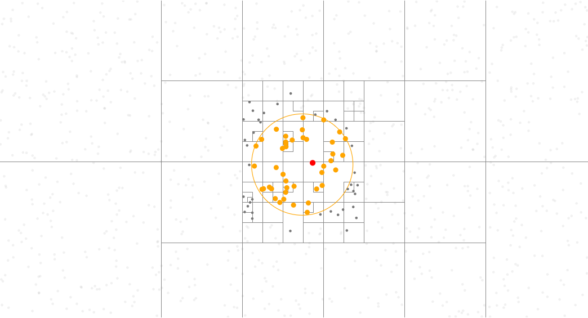

Quadtree Find Circle
====================

1. Prepare functions for quadtree

.. code:: python

   # https://observablehq.com/@d3/quadtree-findincircle
   from math import hypot
   from random import random
   from pathlib import Path
   import detroit_live as d3

   # https://github.com/bourbonut/detroit-live/blob/main/examples/styles/quadtree-find_circle.css
   # Style used later in the example
   STYLE_PATH = Path(__file__).resolve().parent / "styles" / "quadtree_find_circle.css"

   # Declare the chart dimensions
   width = 928
   height = 500
   radius = 80

   # Get quadtree rectangles
   def materialize(quadtree):
      rects = []

      def visit(node, x0, y0, x1, y1):
          rects.append({"x0": x0, "y0": y0, "x1": x1, "y1": y1, "node": node})

      quadtree.visit(visit)
      return rects

   # find points in a specified circle
   def find_in_circle_mark(quadtree, x, y, radius):
      result = []

      def accept(d):
          result.append(d)

      def visit(node, x1, y1, x2, y2):
          if isinstance(node, list):
              if len(node) == 4:
                  node.append({"visited": True})
              else:
                  node[4]["visited"] = True

              return (
                  x1 >= x + radius
                  or y1 >= y + radius
                  or x2 < x - radius
                  or y2 < y - radius
              )

          while True:
              d = node["data"]
              d["visited"] = True
              if hypot(d["x"] - x, d["y"] - y) < radius:
                  accept(d)
              node = node.get("next")
              if node is None:
                  break

      quadtree.visit(visit)
      return result

2. Create data and create quadtree

.. code:: python

   data = [{"x": random() * width, "y": random() * height} for _ in range(1000)]

   quadtree = (
      d3.quadtree()
      .x(lambda d: d["x"])
      .y(lambda d: d["y"])
      .set_extent([[-1, -1], [width + 1, height + 1]])
      .add_all(data)
   )

.. warning::

   The number of points in this example is :code:`1000`. It might be laggy and in this case, this number should be decreased. Performance will be improved in future versions.

3. Prepare containers and make the quadtree visualization.

.. code:: python

   html = d3.create("html")
   head = html.append("head").append("style").text(STYLE_PATH.read_text())
   svg = (
      html.append("body")
      .append("svg")
      .attr("width", width)
      .attr("height", height)
      .attr("viewBox", " ".join(map(str, [0, 0, width, height])))
      .style("cursor", "crosshair")
   )

   quad = (
      svg.select_all(".node")
      .data(materialize(quadtree))
      .enter()
      .append("rect")
      .attr("class", "node")
      .attr("x", lambda d: d["x0"])
      .attr("y", lambda d: d["y0"])
      .attr("width", lambda d: d["y1"] - d["y0"])
      .attr("height", lambda d: d["x1"] - d["x0"])
   )

   # Cursor circle
   circle = (
      svg.select_all(".radius")
      .data([radius])
      .join("circle")
      .attr("r", lambda d: d)
      .attr("class", "radius")
      .attr("stroke", "orange")
      .attr("fill", "none")
   )

   point = (
      svg.select_all("circle")
      .data(data)
      .enter()
      .append("circle")
      .attr("cx", lambda d: d["x"])
      .attr("cy", lambda d: d["y"])
      .attr("r", 2)
   )

4. Create event callback and add it to SVG container

.. code:: python

   def quad_each(_, d):
      node = d["node"]
      if isinstance(node, list):
          if len(node) == 4:
              node.append({"visited": False})
          else:
              node[4]["visited"] = False
      else:
          node["visited"] = False

   def point_each(_, d):
      d["visited"] = False

   def move(event, _, node):
      x, y = (200, 200) if event is None else d3.pointer(event, node)

      quad.each(quad_each)
      point.each(point_each)

      one = quadtree.find(x, y, radius)
      all_ = find_in_circle_mark(quadtree, x, y, radius)

      def update_quad_class(d):
          node = d["node"]
          visited = node[4]["visited"] if isinstance(node, list) else node["visited"]
          return "node visited" if visited else "node"

      def update_point_class(d):
          return " ".join(
              (
                  "visited" if d["visited"] else "",
                  "all" if d in all_ else "",
                  "find" if d == one else "",
              )
          ).strip()

      quad.attr("class", update_quad_class)
      point.attr("class", update_point_class)

      circle.attr("cx", x).attr("cy", y)

   svg.on(
      "mousemove click",
      move,
      extra_nodes=quad.nodes() + point.nodes() + circle.nodes()
   )

   # Initialize values
   move(None, None, None)

.. note::

   In this example, callback is going to be applied on the :code:`<svg>` element by default.
   It means that if there is a change on :code:`"mousemove"` or :code:`"click"` event listeners, then only the svg will be updated.
   However, explicitely adding :code:`extra_nodes = quad.nodes() + point.nodes() + circle.nodes()` allows to update all :code:`quad`, :code:`point` and :code:`circle`.

5. Create an application and run it locally

.. code:: python

   html.create_app().run()
